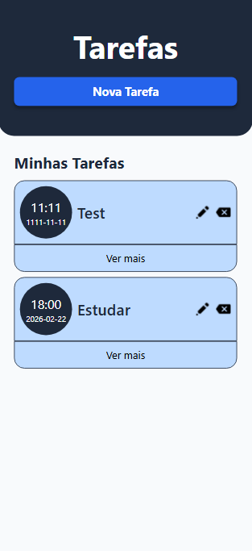

# Todo List - React & TailwindCSS

Uma aplicação de lista de tarefas robusta, desenvolvida com foco em **arquitetura de componentes**, **limpeza de código** e **experiência mobile-first**. Este projeto vai além do básico, explorando hooks avançados e roteamento dinâmico para criar uma ferramenta de produtividade fluida.



## Tecnologias Utilizadas

* **React.js** (Hooks, Props, Context API)
* **TailwindCSS** (Estilização responsiva e utilitária)
* **React Router Dom** (Navegação entre páginas)
* **Local Storage** (Persistência de dados no navegador)

## Arquitetura e Lógica

O projeto foi estruturado para manter lógicas curtas e responsabilidades bem definidas, utilizando o que há de melhor no ecossistema React:

* **Componentização:** Divisão da interface em pequenas unidades reutilizáveis para facilitar a manutenção.
* **Context API (`useContext`):** Gerenciamento de estado global para acesso simplificado aos dados em diferentes níveis da árvore de componentes.
* **Hooks Nativos:** Uso estratégico de `useState` para estado local, `useEffect` para persistência e `useNavigate`/`useLocation` para controle de fluxo.
* **Validação de Formulários:** Sistema de inputs obrigatórios para garantir a integridade dos dados (Data, Hora, Texto e Descrição).

## Funcionalidades

A aplicação está dividida em 3 fluxos principais, todos otimizados especificamente para dispositivos móveis:

1.  **Home:**
    * Listagem dinâmica de tarefas recuperadas do LocalStorage.
    * Ações de gerenciamento: Excluir, Editar e Adicionar.
2.  **Página de Criação:**
    * Interface dedicada com inputs para Título, Descrição, Data e Hora.
    * Validação nativa para impedir o envio de campos vazios.
3.  **Página de Edição:**
    * Carregamento automático dos dados da tarefa selecionada na célula correspondente.
    * Edição em tempo real e atualização do estado global.

## Persistência

Os dados são armazenados localmente através da **Web Storage API (localStorage)**, garantindo que as notas persistam mesmo após o fechamento ou recarregamento do navegador.

---

## Como rodar o projeto

```bash
# Clone o repositório
git clone "https://github.com/Herdes-s/Lista_de_itens"

# Entre na pasta do projeto
cd Lista_de_itens

# Instale as dependências
npm install

# Inicie o servidor de desenvolvimento
npm run dev

```

---

## Autor

Desenvolvido por Ernand Soares
